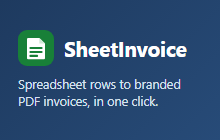

# Rowvoice

Rowvoice is a Google Sheets add-on that turns a spreadsheet row into a branded PDF invoice in Google Drive, then writes the invoice number, status, and link back to the sheet.

**Site:** [rowvoice.com](https://rowvoice.com) · **Privacy:** [rowvoice.com/privacy](https://rowvoice.com/privacy)



The banner above is the Marketplace card asset in this repo. Product screenshots of the sidebar are not checked in. The live site shows an HTML illustration of a sheet row becoming an invoice.

## Status

The marketing site is live. The Google Workspace Marketplace listing is **not public yet**, and OAuth verification is **not complete**. Until a public listing exists, [rowvoice.com](https://rowvoice.com) offers a launch notification instead of an install button.

A development install with [clasp](https://github.com/google/clasp) (below) runs the add-on in a spreadsheet you control. That is not a Marketplace install.

## What it does

- Reads the header row (including sheets with a title banner) and matches columns such as client, email, description, amount, and due date.
- Builds a PDF from a Classic or Modern template, with your logo, tax ID, line items, discounts, and notes.
- Saves the PDF to a Rowvoice folder in Drive and writes the invoice number, status, and link back to the row.
- Previews an invoice before a number is used. Marks invoiced rows paid. Numbers invoices without duplicating a row.
- On Pro, emails the PDF from the user's own Gmail account. The add-on does not read mail.

Spreadsheet contents stay in the user's Google account. The license server receives a Google-signed identity token and a usage count, not invoice line items. Details are in the [privacy policy](https://rowvoice.com/privacy).

## Plans

| Plan | Price | Includes |
| --- | --- | --- |
| Free | $0 | 5 invoices per month, with a "Made with Rowvoice" footer |
| Pro | $6/month or $49/year | Unlimited invoices, no footer, email from Gmail, Stripe billing portal |

## Stack

- **Google Apps Script** for the Sheets add-on (`addon/`)
- **Cloudflare Workers and KV** for licensing, usage counts, and the Stripe billing portal (`license-worker/`)
- **Stripe** for Pro subscriptions
- **Cloudflare Workers static assets** for the marketing site, privacy policy, and terms (`site/`)

The add-on uses non-restricted scopes, including `drive.file` rather than full Drive access. Plan checks use a Google ID token. There is no open email lookup.

## Repository layout

```
addon/              Apps Script project (pushed with clasp)
license-worker/     Cloudflare Worker + KV, Stripe webhook
site/               Landing page, privacy policy, terms
docs/               Publishing notes and store assets
tests/              Node unit tests for the add-on's pure logic
```

`npm test` from the repo root runs the add-on tests and the license Worker tests. It needs Node 20+ and nothing else to install.

## Develop

1. Install clasp: `npm i -g @google/clasp`
2. Turn on the Apps Script API: https://script.google.com/home/usersettings
3. `clasp login` (opens a browser)
4. Create a test spreadsheet at https://sheets.new and copy its ID from the URL.
5. From `addon/`, bind a script to it:

   ```sh
   cd addon
   clasp create --type sheets --title "Rowvoice" --parentId <SPREADSHEET_ID> --rootDir .
   ```

   This writes `addon/.clasp.json`, which is gitignored. To point at an existing script, copy `.clasp.json.example` and fill in `YOUR_SCRIPT_ID` and `YOUR_TEST_SPREADSHEET_ID`. Keep real IDs in a local `docs/OPERATOR_NOTES.md` (gitignored). See `docs/OPERATOR_NOTES.md.example`.

   If clasp asks to overwrite local files, answer **no**. Then check that `appsscript.json` still lists the seven scopes.
6. `clasp push` (use `clasp push --watch` while developing)

### Try the add-on

1. Reload the spreadsheet, then **Extensions → Rowvoice → Open Rowvoice**, and approve the permissions.
2. Fastest path: **Insert starter sheet**, enter a business name, then **Create invoice(s)**.
3. On your own sheet, headers can sit in any of the first 10 rows. Columns such as `Customer | Email | Services | Total | Due` are matched automatically.
4. For several line items, put one item per line in the description cell, such as `Logo design | 800` and `Brand guide | 400`.
5. Select a row and click **Preview**, then **Create invoice(s)**.
6. The PDF goes to a `Rowvoice` folder in Drive. The row gets the invoice number, `Unpaid`, and an "Open PDF" link.

### Test checklist

- Mapping and profile persist after reloading the sheet
- The PDF shows the logo, the line items, and the correct total, in both templates
- Selecting several rows creates one invoice each; already-invoiced rows are skipped
- Clicking Create twice quickly never produces duplicate invoice numbers or a second invoice for the same row
- Starter sheet: inserted, formatted, mapped, with row 2 selected; inserting again creates "Invoices 2"
- A sheet with a title banner in rows 1–3 detects the right header row
- Preview opens a dialog and uses no invoice number and no usage
- The 6th invoice in a month is blocked on the free plan, with one error instead of one per selected row
- Insert a column before mapped columns: the mapping follows the headers
- A de_DE spreadsheet: `Audit | 1.200,50` parses as 1200.50, and money is formatted as `1.200,50 €`
- Tax and discount: the total is (subtotal − discount) × (1 + rate)
- Selecting 30+ rows shows progress and finishes (5 rows per server call)
- Pro: "Email each invoice" sends the PDF from Gmail and adds a note to the Status cell
- "Mark Paid" updates only rows that already have an invoice number
- "One sequence across all my spreadsheets" continues numbering across two spreadsheets
- Pro: "Manage billing" opens the Stripe portal

Publishing steps, without production identifiers, are in `docs/PUBLISHING.md` and `docs/LAUNCH.md`.

## License

[MIT](LICENSE). Copyright 2026 CAPTURES BY JC LLC.
